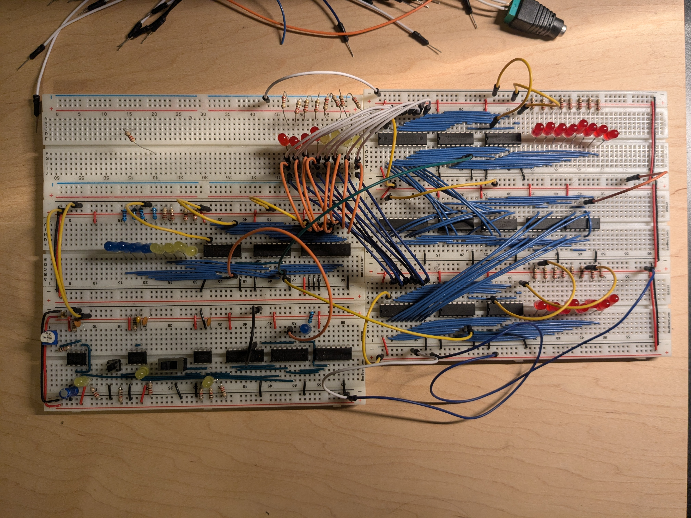

# 8bit-Computer

# Background

This is not my design, all credit goes to Ben Eater. https://eater.net/

I started this project in hopes to get a deeper understanding of how computers work while I was taking Operating Systems at University, and WOW did I learn a lot.
It is eletrical and computer engineering heavy, but just chug through it

This project unfortunately is not fully complete, (life gets in the way sometimes) But it can move data between 2 registers, and preform simple arithmetic with the ALU.

Recomended Tools:
- IRWIN VISE-GRIP Wire Stripper
- CHP PN-2006 Long-Nose Pliers
- Hakko CHP CSP-30-1 Wire Stripper
- Hakko CHP-170 - Micro Soft Wire Cutter
- Digital Caliper Measuring Tool
